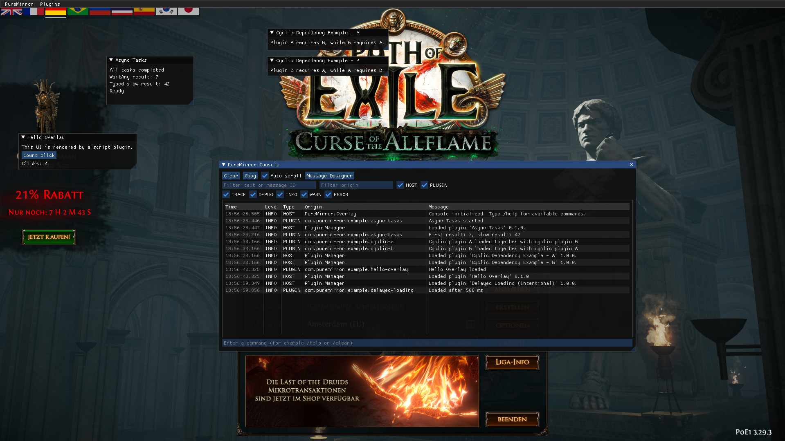

# PureMirror

PureMirror is a modular Windows in-game overlay written in C++. It provides a Dear ImGui user interface and an AngelScript-based plugin runtime with lifecycle callbacks, logging, dependency management, parallel asynchronous tasks, and coroutines.

## Projects

- **PureMirror.Entry** is the DXGI proxy loaded by the target application. It forwards DXGI exports to the system library and bootstraps `PureMirror.Runtime`.
- **PureMirror.Runtime** detects and hooks the active graphics backend, manages the render thread and textures, forwards input, and loads the high-level overlay module. It currently contains backends for DirectX 9/10/11/12, OpenGL, and Vulkan.
- **PureMirror.Overlay** contains the visible application layer: menus, console, logging, plugin discovery and dependency resolution, and the AngelScript host. It also schedules script callbacks, asynchronous tasks, waits, sleeps, yields, and coroutines across multiple plugins.
- **PureMirror.Imgui** builds Dear ImGui as a shared library used by both the renderer and the overlay, giving the modules a common ImGui API and context boundary.
- **PureMirror.AngelScript** builds the vendored AngelScript runtime and its official string and array add-ons as a static library.
- **PureMirror.Overlay.Tests** contains the automated tests for the overlay core, plugin planning and resolution, scripting integration, callback restrictions, and AngelScript bindings.

## First Look

